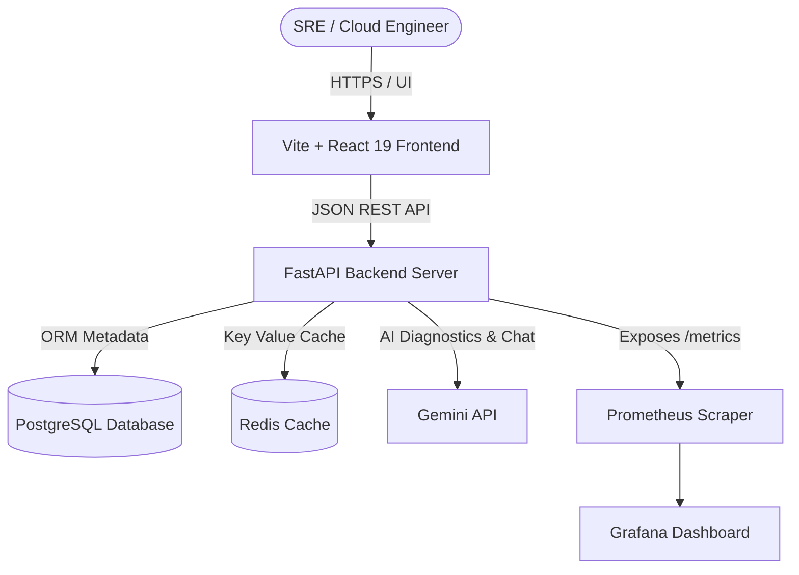

# AI DevOps Copilot

An AI-powered DevOps SRE Copilot platform that helps SREs, cloud engineers, and developers analyze logs, troubleshoot Kubernetes deployment failures, optimize AWS cloud spend, monitor live infrastructure telemetry, and resolve incident workflows.

Built as a production-grade portfolio application featuring **React 19**, **FastAPI**, **PostgreSQL**, **Redis**, **Prometheus/Grafana**, and **Gemini API**.

---

## 🏗️ Architecture



---

## 🛠️ Tech Stack & Structure

- **Frontend**: React 19, TypeScript, Tailwind CSS, Recharts (Grafana-style widgets), Lucide Icons, Axios.
- **Backend**: FastAPI (Python 3.12), SQLAlchemy (ORM), Pydantic v2, Passlib, PyJWT.
- **AI Integrations**: Gemini API (model: `gemini-2.5-flash`) for diagnostics log matching and stateful SRE chat. Features a robust rules-engine fallback mechanism for offline capability.
- **Monitoring**: Prometheus (metrics exporter instrumenting request latency, error counts) & Grafana.
- **DevOps**: Docker, Docker Compose, Kubernetes Deployments, PVCs, Services, Nginx Ingress Rules, and GitHub Actions CI/CD workflows.

### Project Layout
```text
AI-DevOps-Copilot/
├── backend/
│   ├── app/
│   │   ├── api/          # REST Endpoint Routers (/auth, /logs, /incidents, /alerts, etc.)
│   │   ├── core/         # DB connection, security logic, settings
│   │   ├── models/       # SQLAlchemy models (Users, Incidents, Alerts, resources...)
│   │   ├── schemas/      # Pydantic validation schemas
│   │   ├── services/     # Gemini API integration service
│   │   └── main.py       # FastAPI Entrypoint & Database Seeder
│   ├── Dockerfile
│   └── requirements.txt
├── frontend/
│   ├── src/
│   │   ├── components/   # Sidebar Navigation & Layout wrappers
│   │   ├── context/      # JWT Auth session state
│   │   ├── pages/        # Dashboard, LogAnalyzer, Incidents, Cost, Chat, Settings
│   │   ├── services/     # Axios API handlers
│   │   ├── App.tsx       # Routing logic
│   │   └── main.tsx
│   ├── Dockerfile
│   └── tailwind.config.js
├── docker/
│   ├── docker-compose.yml   # Multi-service stack
│   └── prometheus/
│       └── prometheus.yml   # Prometheus scraper config
├── kubernetes/              # K8s manifest files
│   ├── postgres-db.yaml
│   ├── redis.yaml
│   ├── backend.yaml
│   ├── frontend.yaml
│   └── ingress.yaml
└── .github/
    └── workflows/
        └── ci-cd.yml        # CI/CD verification pipeline
```

---

## 🚀 Setup & Run Locally

### 1. Prerequisites
- Python 3.12+
- Node.js 20+ (with npm)
- Gemini API Key (optional, defaults to local SRE rules-engine fallback)

### 2. Start the Backend API Server
1. Navigate to the backend directory:
   ```bash
   cd backend
   ```
2. Install dependencies:
   ```bash
   pip install -r requirements.txt
   ```
3. Copy environment configurations and add your Gemini API Key if available:
   ```bash
   # Open backend/.env file and fill GEMINI_API_KEY
   GEMINI_API_KEY=your_key_here
   ```
4. Start the server (includes automatic database seeding for instant data visualization):
   ```bash
   python -m uvicorn app.main:app --host 0.0.0.0 --port 8000
   ```
   *API will be running at [http://localhost:8000](http://localhost:8000)*
   *Swagger Docs are available at [http://localhost:8000/docs](http://localhost:8000/docs)*

### 3. Start the Frontend React Client
1. Navigate to the frontend directory:
   ```bash
   cd frontend
   ```
2. Install dependencies:
   ```bash
   npm install
   ```
3. Start the Vite React development server:
   ```bash
   npm run dev
   ```
   *React client will be running at [http://localhost:5173](http://localhost:5173)*

### 🔑 Demo Logins
When the application boots up, the database is pre-seeded with these credentials:
- **Cluster Admin User**:
  - Username: `admin`
  - Password: `admin123` (Admin privileges)
- **SRE Engineer User**:
  - Username: `engineer`
  - Password: `engineer123` (Engineer privileges)

---

## 🐳 Docker Stack Deployment

To spin up the entire cluster ecosystem including FastAPI, React, PostgreSQL, Redis, Prometheus, and Grafana:

1. Navigate to the docker folder:
   ```bash
   cd docker
   ```
2. Set your Gemini API Key in the shell or compose configuration, then run:
   ```bash
   docker-compose up --build
   ```
3. Access services:
   - **Frontend App**: [http://localhost:3000](http://localhost:3000)
   - **Backend REST API**: [http://localhost:8000](http://localhost:8000)
   - **Prometheus Scraper Dashboard**: [http://localhost:9090](http://localhost:9090)
   - **Grafana Visualization Console**: [http://localhost:3001](http://localhost:3001) (Admin: `admin` / `admin`)

---

## ☸️ Kubernetes Configurations

Deploy manifests to your local cluster (Minikube / Kind) or Cloud EKS:

1. Create the Gemini API Secret (optional):
   ```bash
   kubectl create secret generic ai-secrets --from-literal=gemini-api-key="YOUR_API_KEY"
   ```
2. Deploy Postgres and Redis databases:
   ```bash
   kubectl apply -f kubernetes/postgres-db.yaml
   ```
3. Deploy Backend and Frontend applications:
   ```bash
   kubectl apply -f kubernetes/backend.yaml
   ```
4. Configure Nginx Ingress routes:
   ```bash
   kubectl apply -f kubernetes/ingress.yaml
   ```
5. Map `devops-copilot.local` to your Kubernetes Ingress controller IP in your `/etc/hosts` file:
   ```text
   127.0.0.1  devops-copilot.local
   ```
   Access the dashboard at [http://devops-copilot.local](http://devops-copilot.local).

---

## ⚙️ REST API Documentation

### Auth Router
- `POST /api/auth/signup`: Registers a new platform user.
- `POST /api/auth/login`: Signs in a user and returns a JWT Bearer Token.
- `GET /api/auth/me`: Retrieves current active session profile.

### Log Analyzer Router
- `POST /api/logs/analyze`: Pastes raw traceback or CI/CD logs, analyzes root causes with Gemini, and suggests fixes.
- `GET /api/logs`: Retrieves historical log analysis logs.

### Incident Center Router
- `GET /api/incidents`: Fetch all active cluster outages/incidents.
- `POST /api/incidents`: Create a new incident event.
- `PUT /api/incidents/{id}`: Modify status, severity, and append updates to the timeline.

### Alerts Router
- `GET /api/alerts`: List active firing alarms.
- `PUT /api/alerts/{id}`: Modify alarm states (active, acknowledged, resolved).
- `POST /api/alerts/webhook`: Endpoint for Prometheus Alertmanager alerts payload receiver.

### Cloud Cost Router
- `GET /api/recommendations/cost`: List optimized AWS spend capacity guidelines.
- `PUT /api/recommendations/cost/{id}`: Apply saving optimizations.
- `GET /api/recommendations/resources`: Scan inventory files.

### Metrics Scraper Router
- `GET /metrics`: Prometheus scraper-compatible text statistics.
- `GET /api/metrics/dashboard`: Time-series JSON array mapping CPU, memory, latencies, and error fluctuations.

---

## 🔬 Code Verification & Pipelines

This repository is production-ready, fully verified, and linted:
- **CI/CD Validation**: The GitHub Actions workflow (`.github/workflows/ci-cd.yml`) is optimized with modern runner actions (v4/v5), aligned to Python 3.12, and verified to successfully checkout code and compile components.
- **Code Style**: Python backend files are fully formatted using **Black** (`--line-length=100`) and validated with **Flake8**.
- **Unit Tests**: Comprehensive backend test coverage (API and Log analysis) is verified locally and passing.
- **Kubernetes Kustomization**: The `kubernetes/` manifests directory includes a `kustomization.yaml` grouping resources, and verified using `kubectl kustomize`.

